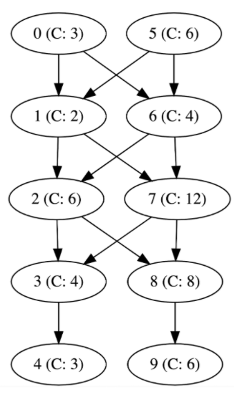

# Problem C3: CI-Pipelines
After some much needed upgrades to our infrastructure, servers are no longer confined to their pipelines! This means that one server can receive inputs from multiple other servers and can pass off its output to a range of servers yet again. We hope that this will remove bottlenecks from our system and speed up deployment.

Servers with multiple output destinations can choose which server to pass their results to. They are free to divide their output in any ratio among their downstream servers in order to maximize throughput.

Input format and constraint remain the same.

## Constraints
0 < N < 1500

## Sample

### Sample Input
```
10    N, the number of servers

3     Server 0 has capacity 3
2     Server 1 has capacity 2
6     …
4
3
6
4
12
8
6

0 1   Server 0 pushes to 1
0 6   Server 0 pushes to 6, too
1 2
1 7
2 3
2 8
3 4
5 6
5 1
6 7
6 2
7 8
7 3
8 9
```

### Sample Output
`6`

### Explanation of Sample
Server 5 can divide up its capacity and send 2 revisions to Server 1 and 4 revisions to Server 6. But now, the second stage (Server 1 and 6) are at full capacity and cannot process any more revision from Server 0. The remaining stages can process more than 6 revisions so the second stage is the bottleneck which has a capacity of 6.


