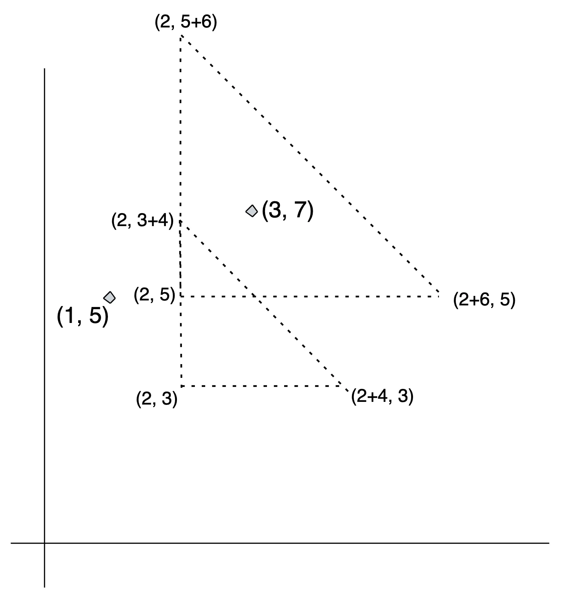

# Problem D1: Data Centers
The Factory Builder of Hilarious Allocations and Calculated Kingdoms (**FB HACK**) has decided to build their Data Centers on a particular piece of land with a special property; only Data Centers within a region defined by an axis-aligned right-angle isosceles triangle have network outages.

**FB HACK** is convinced this special property will ensure that their Data Centers are safe since they will be able to easily predict how many of them will be affected when a particular network outage happens. Your task is to write a program that outputs the **number of Data Centers that will be affected by each network outage** given the position of data centers and a list of triangular regions that will have network outages.

**FB HACK** only has a few Data Centers located in a small area which makes the risk of a network outage happening very low.

## Input Format
The input will contain two integers (N Q). N represents the number of Data Centers owned by FB HACK. Q represents the number of possible network outages that can happen.

N lines will follow with two integers X Y , each representing the lattice points of the Data Centers.

Q lines will follow with three integers x y d representing the affected area by the network outage as the triangle ABC with vertices at A(x+d,y),B(x,y),C(x,y+d)

## Constraints
1 ≤ N ≤ 30
1 ≤ Q ≤ 5
1 ≤ X_i, Y_i ≤ 3*10^2
1 ≤ x,y,d ≤ 3*10^2

## Output Format
For each of Q queries, output one integer on a new line which denotes the number of Data Centers that will be affected by the network outage happening in the triage with vertices A(x+d,y),B(x,y),C(x,y+d)

## Sample
### Input
```
2 2
1 5
3 7
2 5 6
2 3 4
```

### Output
```
1
0
```

### Explanation
There are 2 Data Centers and 2 triangle network outages.
For the first outage trian(2, 5, 6), only the Data Center at (3, 7) is affected. So the output is 1.
For the second outage (2, 3, 4), no Data Center is affected. So the output is 0.



